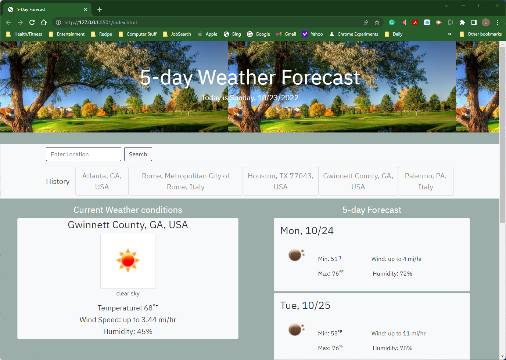

# Mod06-C-Weather-Dashboard

## Description
Creates a weather dashboard using server-side APIs

This application provides a 5-day forecast for the traveler in need. Allows the user to enter a US city and state , US zip code, or a city and country. Some examples are 77043; 30340; Houston, TX; Atlanta, GA; Paris, TX; Paris, France; and Rome, IT.

It will save the information in localStorage for to revisit that city's forecast. Future changes to this application will provide a way to delete the location in localStorage. Also provide feedback as to when the location was not found.

I learned about API's and the massive amount of data they can provide.

## Installation

Just run this application from the Delpoyed GitHub webpage: 
    https://lricciardo.github.io/Mod06-C-Weather-Dashboard/

## Usage

Enter a US city and state , US zip code, or a city and country. Some examples are 77043; 30340; Houston, TX; Atlanta, GA; Paris, TX; Paris, France; and Rome, IT. Or click on a location that has been entered.

[click Here for Big Screenshot of 5-Day Forecast Dashboard](./assets/images/Mod06-Screenshot.png)

## Credits

I'd like to that the Academy; all the TA's that tried to help with spaghetti code trying to drop hints; my instructor Trey Eckels for humor and patience; and, of course, my family for all they have to do so I can do this. (I love you guys!)

## License

Please refer to GitHub for MIT License agreement.

---